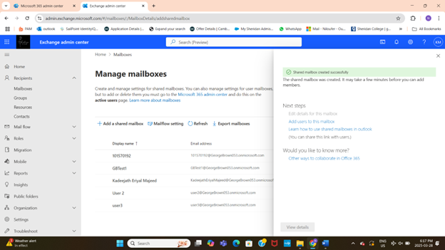
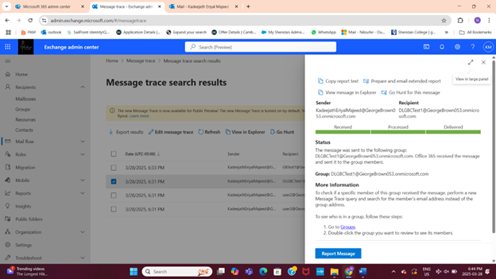
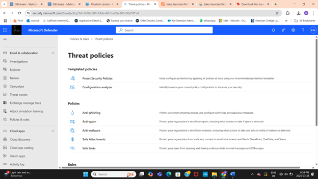

# Exchange Online Configuration and Mail Flow Management

## Project Overview
Configured Exchange Online components to facilitate efficient and secure email communication within the organization. This included mailbox and distribution list management, permission assignments, and mail flow monitoring.

## Key Tasks
- Created shared mailboxes and distribution lists with appropriate permissions  
    
- Added and managed mailbox members and group owners  
- Conducted mail flow troubleshooting and message trace analysis  
    
- Configured malware and threat protection policies in Microsoft Defender  
    
- Verified mail delivery to ensure operational email communications  

## Tools & Technologies
- Exchange Admin Center  
- Microsoft Defender Security Center  
- Microsoft 365 Admin Center  

## Outcome
Achieved optimized email communication workflows with enhanced security and effective administrative control.
