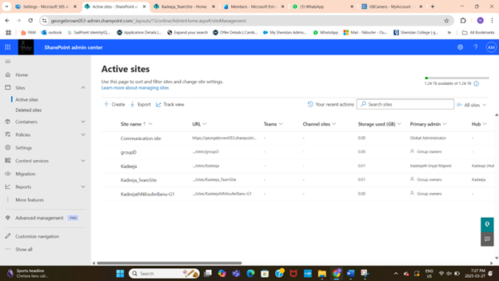

# SharePoint Site Creation and Administration

## Project Overview
Set up and administered SharePoint Online sites to enhance collaboration and document management. Created communication and team sites, managed site memberships, and implemented sharing policies.

## Key Tasks
- Created Communication and Team sites using SharePoint Admin Center  
    
    
- Configured site owners, members, and permissions  
- Managed site privacy settings and sharing policies, including restricting external sharing  
- Registered sites as hub sites and associated team sites with communication hubs  
    
- Supported organizational collaboration through effective site governance  

## Tools & Technologies
- SharePoint Admin Center  
- Microsoft 365 Admin Center  

## Outcome
Enabled structured and secure collaboration environments aligned with organizational needs and governance policies.
