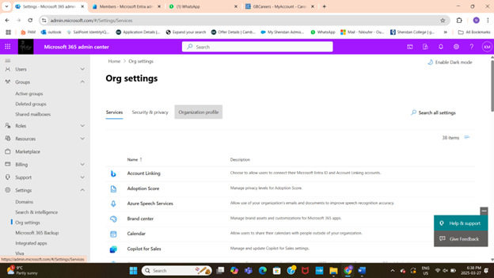

# Organization Branding and Tenant Customization

## Project Overview
Customized the Microsoft 365 tenant to reflect the organization's brand identity and improved the user experience by configuring themes, logos, helpdesk information, and release preferences.

## Key Tasks
- Uploaded custom organization logo and configured clickable link to external site
- Modified tenant theme colors to align with branding guidelines  
    
- Added helpdesk contact details for streamlined user support  
    
- Configured targeted release preferences to manage feature rollouts  
    
- Enhanced organizational consistency and end-user satisfaction through branding  

## Tools & Technologies
- Microsoft 365 Admin Center  

## Outcome
Delivered a branded and user-friendly Microsoft 365 tenant environment that supports organizational identity and effective support.
