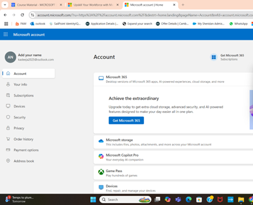
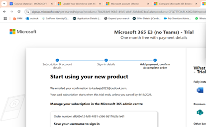
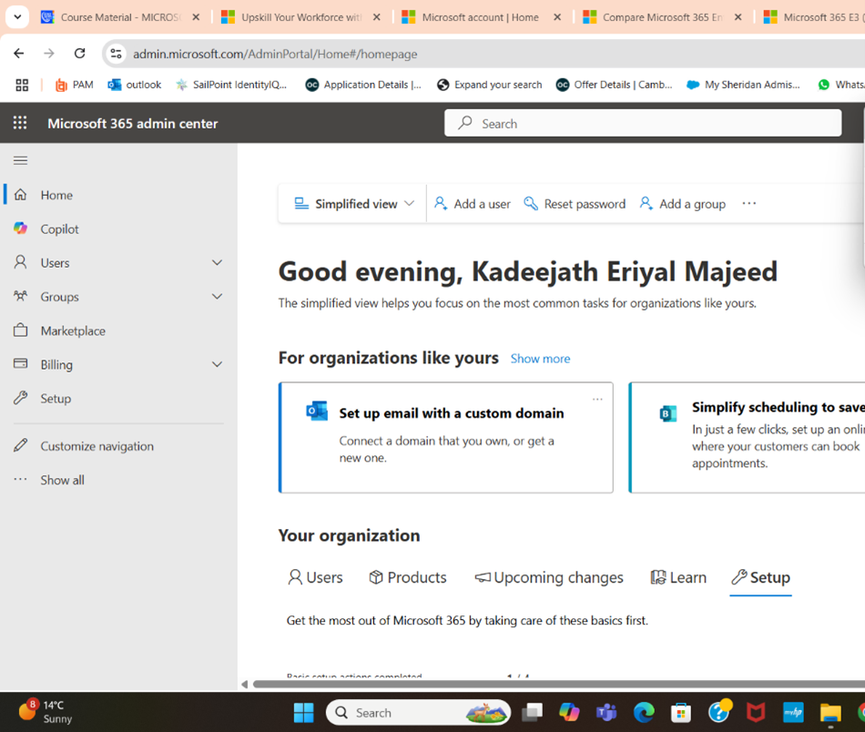
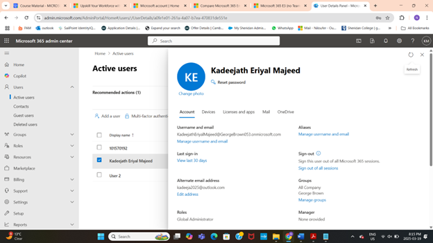
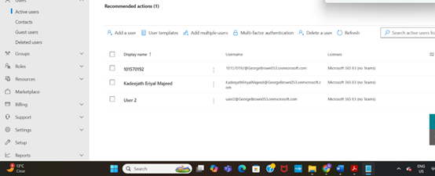

# Microsoft 365 Tenant Setup and Subscription Management

## Project Overview  
Provisioned and configured a Microsoft 365 tenant for a client, including account creation, trial subscription activation, and user role assignments. The project focused on establishing a secure cloud environment tailored to client needs.

---

## Key Project Tasks and Deliverables

### 1. Microsoft Account Creation and Microsoft 365 Trial Subscription  
- Created a new Microsoft account.  
- Signed up for the Microsoft 365 E3 one-month free trial.  
- Completed subscription details including contact and payment information.

---

### 2. Tenant Access and User Role Setup  
- Logged into Microsoft 365 Admin Center with the new account.  
- Created two new users: one assigned Global Admin role, the other Exchange Admin role.  
- Assigned Microsoft 365 E3 licenses to users.

---

## Tools and Technologies Used  
- Microsoft 365 Admin Center  
- Microsoft 365 E3 Trial Subscription  
- User and Role Management within Microsoft 365  

---

## Project Outcomes  
- Successfully provisioned a Microsoft 365 tenant ready for enterprise use.  
- Established proper admin roles to secure tenant operations.  
- Laid the foundation for user and license management automation.

---

## Skills Demonstrated  
- Tenant setup and subscription management  
- User creation and role assignment best practices  
- Licensing management and administration  
