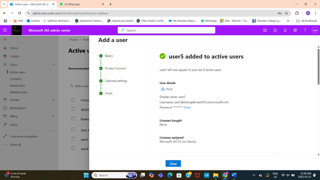
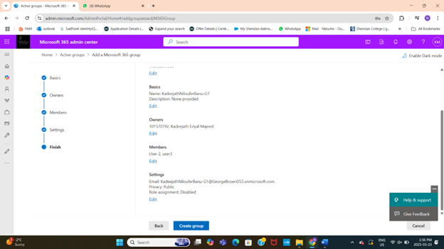
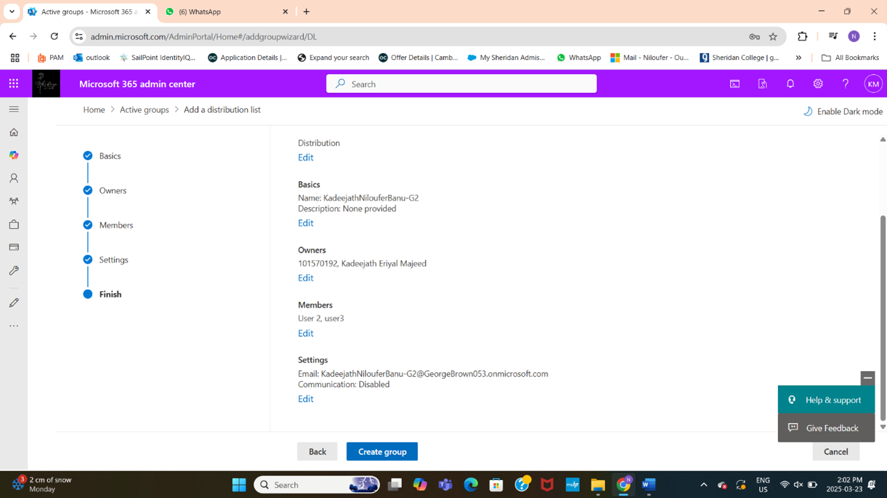
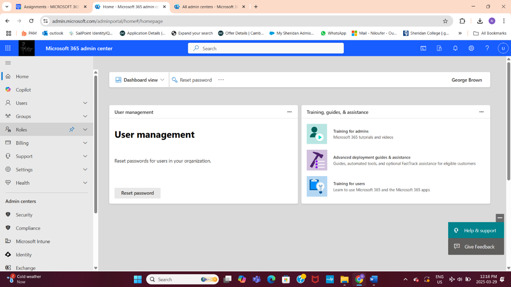

# Microsoft 365 User and Group Management

## Project Overview  
Implemented user and group management for a Microsoft 365 tenant as part of provisioning and administering a secure cloud environment. The work included creating users with assigned roles, managing licenses, and establishing groups for collaboration and communication.

---

## Key Project Tasks and Deliverables

### 1. User Management  
- Created multiple users through Microsoft 365 Admin Center and PowerShell automation.  
- Assigned licenses (Microsoft 365 E3) to users to enable access to enterprise services.  
- Designated roles including Global Administrator and Helpdesk Administrator for delegated administration.  
- Performed user lifecycle management such as deleting and restoring users.

  
*Created users with specific administrative roles and assigned licenses.*

---

### 2. Group Creation and Membership  
- Created Microsoft 365 groups and Distribution Lists via Admin Center.  
- Added users to groups to facilitate communication and collaboration.  
- Configured group privacy, ownership, and membership approval settings.  
- Differentiated group types to suit organizational needs (collaborative vs email distribution).

  
*Setup of Microsoft 365 Group and assignment of owners and members.*

  
*Configured Distribution List with owners and membership rules.*

---

### 3. Delegated Administration and Verification  
- Verified delegated administrator roles by logging in with accounts having limited permissions.  
- Compared dashboards and access levels between Global Admin and Helpdesk Admin roles to ensure proper role segregation.

  
*Helpdesk Administrator limited admin access verified.*

---

## Tools and Technologies Used  
- Microsoft 365 Admin Center  
- Microsoft 365 PowerShell Module  
- Microsoft 365 E3 License  
- Group Management and Security Principles  

---

## Project Outcomes  
- Efficient user provisioning with role-based access controls in Microsoft 365.  
- Established collaboration groups tailored for organizational communication.  
- Enhanced security and administrative delegation through role segregation.  
- Automated parts of the process with PowerShell for scalability.

---

## Skills Demonstrated  
- Microsoft 365 user and license management  
- Group creation and membership management  
- Delegated admin role configuration and verification  
- PowerShell scripting for Microsoft 365 automation  
